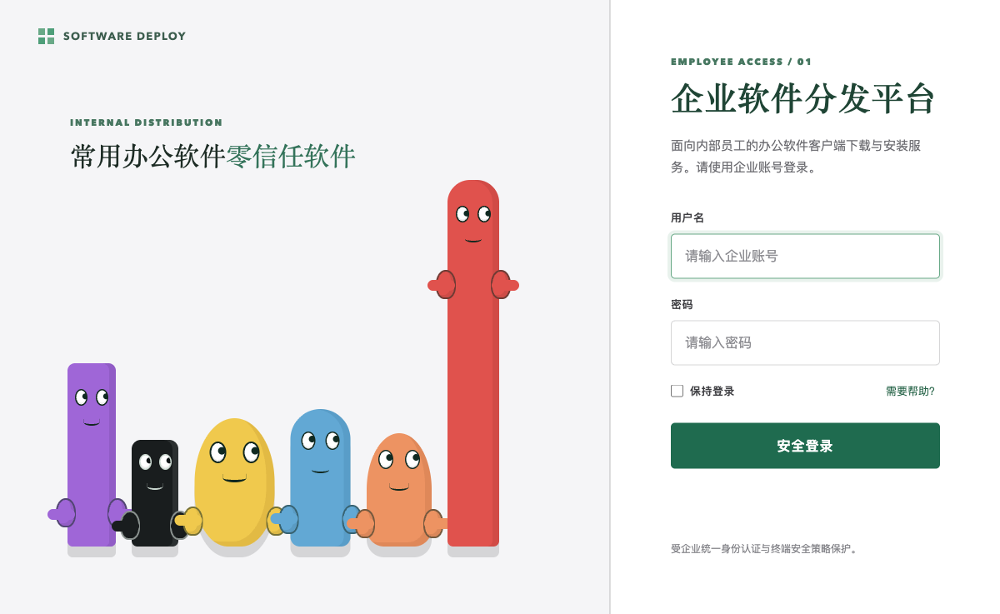
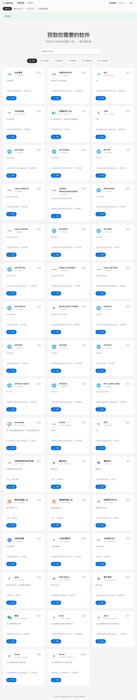
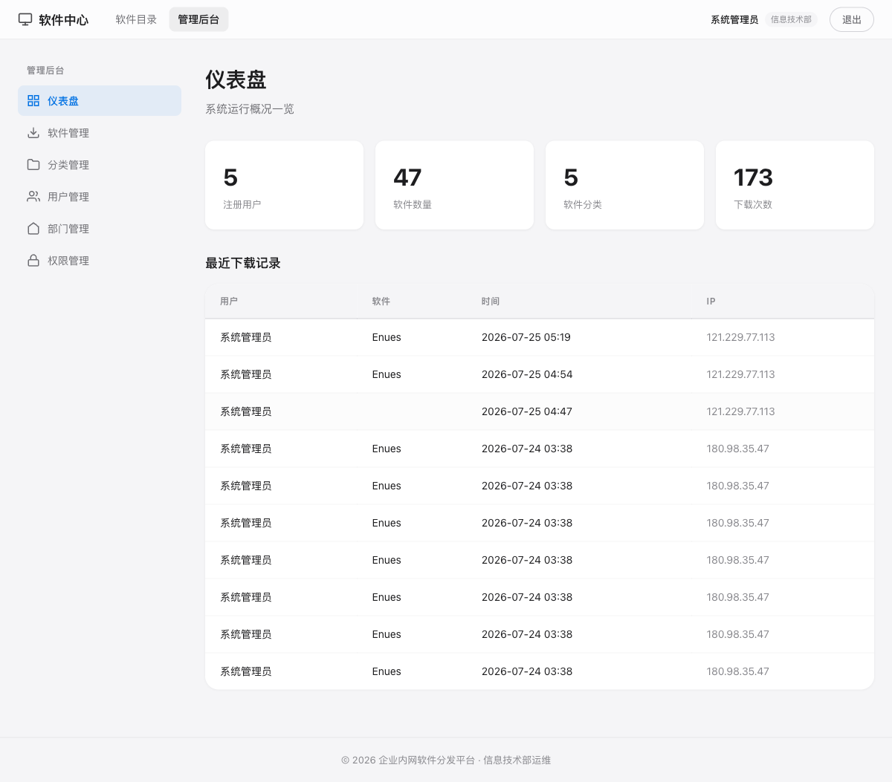
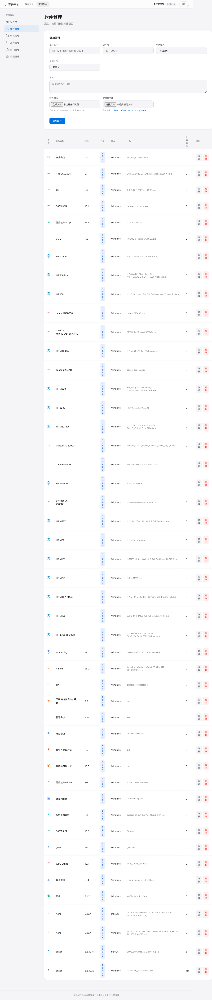

# 企业内网软件分发平台

面向企业内部员工的办公软件客户端下载与安装服务，实现软件统一分发、版本管控、安全合规的全流程管理。

## 功能特性

- **软件目录** — 按分类浏览、搜索、一键下载安装包，支持 Windows / macOS / 信创操作系统三大平台
- **趣味登录页** — 动态电弧边框、常用软件滚动推荐、企业品牌化设计
- **管理后台** — 软件管理、分类管理、用户/部门/权限管理、下载统计仪表盘
- **Apple 风格图标** — 白色 squircle 圆角方形图标，品牌 Logo 自动嵌入，无图标时智能生成品牌色首字母
- **大文件上传** — 支持 2GB 以内文件上传，Gunicorn + Nginx 生产级部署
- **角色权限** — 管理员/普通用户分离，部门级别权限管控

## 页面预览

### 登录页

动态电弧边框 + 常用软件推荐，品牌化登录体验。

### 软件目录

白色 squircle 图标 + 简洁卡片布局，描述自动截断，下载按钮固定底部，同行卡片等高对齐。

### 管理后台 — 仪表盘

注册用户、软件数量、分类数、下载次数一图总览，最近下载记录实时展示。

### 管理后台 — 软件管理

软件上传、图标自定义、分类分配、平台选择、编辑/删除，一站式管理。

## 技术栈

| 层级 | 技术 |
|------|------|
| 后端 | Python 3.9 + Flask 3.0 |
| 数据库 | SQLite (SQLAlchemy ORM) |
| 前端 | Jinja2 模板 + 原生 CSS/JS |
| 部署 | Gunicorn 4 Worker + Nginx 反代 |
| 图标生成 | Pillow + cairosvg (SVG 转 PNG) |

## 快速部署

    pip install -r requirements.txt
    python init_db.py
    gunicorn --workers 4 --bind 0.0.0.0:5000 --timeout 600 app:app

## Nginx 配置参考

    server {
        listen 80;
        server_name software.example.com;
        client_max_body_size 2g;
        proxy_read_timeout 600s;

        location / {
            proxy_pass http://127.0.0.1:5000;
            proxy_set_header Host $host;
            proxy_set_header X-Real-IP $remote_addr;
        }

        location /static/ {
            alias /data/software-portal/static/;
            expires 1d;
            add_header Cache-Control "public";
        }

        location /uploads/ {
            alias /data/software-portal/uploads/;
            expires 1d;
            add_header Cache-Control "public";
        }
    }

## 预置账号

| 角色 | 用户名 | 密码 |
|------|--------|------|
| 管理员 | admin | 自定义 |
| 普通用户 | zhangsan / lisi / wangwu | 123456 |

## 项目结构

    software-portal/
    ├── app.py                 # 主应用（路由、模型、图标生成）
    ├── init_db.py             # 数据库初始化脚本
    ├── requirements.txt       # Python 依赖
    ├── templates/
    │   ├── base.html          # 基础模板
    │   ├── login.html         # 趣味登录页
    │   ├── index.html         # 软件目录页
    │   └── admin/             # 管理后台模板
    ├── static/
    │   ├── css/style.css      # 样式
    │   └── js/                # JS（主逻辑、电弧边框）
    ├── uploads/               # 上传文件存储（安装包、图标）
    └── docs/                  # 截图等文档资源

## License

MIT
